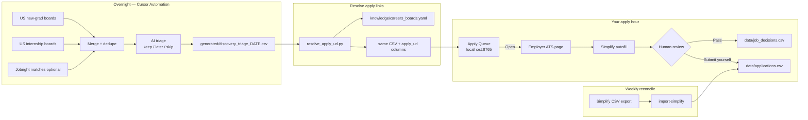
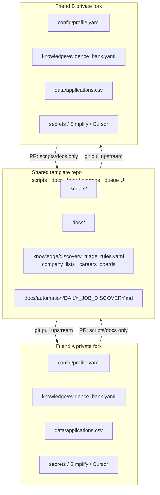

# Friends canvas — Job Search OS (early shared toolkit)

**Audience:** friends collaborating on this repo (right now: Junyi, John, Nana)  
**Tone:** early-stage, honest, build-together  
**Last updated:** 2026-08-17

**Slide deck (PowerPoint-style):** open [`friends-showcase.html`](./friends-showcase.html) in a browser — ← → or click to advance.

This is a **shared pipeline**, not a finished product. Lots of things still break.
That’s fine — the point of inviting friends is so we don’t improve it alone.

---

## 1. What this is (and isn’t)

| This is | This is not |
|---|---|
| A strategy + memory layer around **Simplify** | A second ATS / job board |
| Shared **scripts + docs + discovery sources** | One shared applications ledger for everyone |
| An experiment in Cursor Cloud Agents + autofill | A guaranteed auto-apply bot that “just works” |
| Aimed at **2027** intern / new-grad cycles | A polished multi-user SaaS |

**Rule of thumb:** collaborate on the *engine*; keep *your identity and applications* personal.

---

## 2. Current progress (what already exists)

### Working / usable today
- **Daily Job Discovery** Cursor Automation → scrapes US new-grad + internship lists, writes triage packs
- **Triage outputs** on `main`: keeps / later / skip CSVs under `generated/discovery_triage_YYYY-MM-DD.csv`
- **~438 unique KEEP jobs** accumulated (Jul 20 → Aug 16), after merging the discovery PR backlog
- **Local Apply Queue** (`python3 scripts/serve_apply_queue.py`) — live page at `http://127.0.0.1:8765/`
  - Applied / Pass write into the repo immediately
  - Swipe + undo + live reload when CSVs change
- **Apply-URL resolver** (`scripts/resolve_apply_url.py`) — turns Jobright discovery links into real Greenhouse / Ashby / Workday URLs when possible
- **Simplify profile cleanup** for Junyi (skills, experience, coursework) so autofill has better input
- **Autofill trial** documented in `docs/experiments/2026-07-31_apply_trial.md` (10 jobs, stop before submit)

### Still rough / broken / incomplete
- Jobright “Apply” is often a **signup wall** — discovery URL ≠ apply URL
- Only a minority of keeps resolve automatically to an employer ATS (Workday coverage still thin)
- Google Chrome refuses `--load-extension` in automation; Chromium workaround needed
- Captchas / email verification block unattended login
- Greenhouse autofill coverage looks worse than it is (custom widgets); essays / EEO stay human
- One shared `data/applications.csv` does **not** scale to three people

### What Junyi is working on *right now*
1. **Live review of 10 autofilled application tabs** in a Cloud Agent browser (friends can Take Control / watch)
2. Tightening the **autofill → human-submit** loop (not full unattended submit yet)
3. Making the repo **friend-ready**: template vs personal copy, clear “what to edit”

---

## 3. System architecture (visual)

### End-to-end pipeline



### What is shared vs personal



### Data flow (one person)

```text
Boards  →  triage CSV  →  resolve apply_url  →  apply queue
                                              ↓
                                    Simplify autofill
                                              ↓
                                    YOU click Submit
                                              ↓
                                    tick Applied in queue
                                              ↓
                                    applications.csv
                                              ↓
                         weekly Simplify export → import-simplify
```

---

## 4. Near-term future plan

| Priority | Goal | Why |
|---|---|---|
| P0 | Keep **human-in-the-loop submit** solid | Captcha / EEO / essays aren’t safe to fully automate |
| P0 | Friend onboarding (this doc + CONTRIBUTING) | So forks don’t corrupt one ledger |
| P1 | Better **apply_url** coverage (more Workday / careers map) | Unblocks Open from Jobright walls |
| P1 | Wire resolve into every daily automation run | Keeps should arrive with employer links |
| P2 | Multi-profile layout *or* strict fork discipline | Team use without mixing identities |
| P2 | Clearer autofill metrics (don’t undercount Greenhouse widgets) | Honest quality signal |
| Later | Optional shared “public discovery only” repo | If we want open collaboration without private data |

**Not the plan (yet):** one Cloud Agent auto-submitting for three people from one Simplify login.

---

## 5. If you want to start — files to change for *your* usage

Do this on **your own private fork** (recommended), not by overwriting Junyi’s identity on `main`.

### Must change (your identity)

| File | What to put |
|---|---|
| `config/profile.yaml` | Your name, links, graduation / work-window dates, tracks |
| `knowledge/work_authorization.yaml` | Your non-sensitive auth answers only |
| `knowledge/evidence_bank.yaml` | *Your* skills/projects — don’t invent; mark verified honestly |
| `resumes/` | Your base + cluster resumes |
| `data/resume_versions.csv` | Registry of *your* resume versions |

### Must *not* commit

| Path | Why |
|---|---|
| `secrets/` / `.env` | Simplify / Jobright passwords, cookies |
| Session JSON / storage_state | Login material |
| Someone else’s `data/applications.csv` edits mixed into yours | Tracker corruption |

### Usually leave alone at first (shared engine)

| Path | Purpose |
|---|---|
| `docs/automation/DAILY_JOB_DISCOVERY.md` | Discovery rules (edit via PR if improving for everyone) |
| `knowledge/discovery_triage_rules.yaml` | Shared triage policy |
| `scripts/serve_apply_queue.py` + `static/apply_queue/` | Apply queue |
| `scripts/resolve_apply_url.py` | Employer URL resolver |
| `knowledge/careers_boards.yaml` | Known Greenhouse/Ashby/Workday boards |

### Minimal first-run checklist

```bash
# 1) fork the repo on GitHub, then clone YOUR fork
git clone git@github.com:<you>/job-search-2026-2027-starter.git
cd job-search-2026-2027-starter
git remote add upstream git@github.com:JunyiZhou-Conny/job-search-2026-2027-starter.git

# 2) personalize
#    edit config/profile.yaml
#    replace knowledge/evidence_bank.yaml with yours (or start sparse)
#    clear or ignore data/applications.csv and start fresh

# 3) secrets locally only
cp secrets/.env.example secrets/.env   # if present
# put SIMPLIFY_EMAIL / SIMPLIFY_PASSWORD in env or Cursor secrets — never push

# 4) run apply queue against an existing triage day (or wait for your automation)
python3 scripts/resolve_apply_url.py --date YYYY-MM-DD --write-csv
python3 scripts/serve_apply_queue.py --date YYYY-MM-DD
# open http://127.0.0.1:8765/
```

Point Cursor Cloud Automations at **your fork**, using the pointer in `docs/automation/UI_POINTER.md`.

---

## 6. One template, many personal copies — how do friends *improve* the thing?

Pulling upstream updates the engine. Helping means **sending improvements back upstream** — classic open-source loop:

```text
1. You fork (personal copy)
2. You pull upstream often   → get Junyi’s script/UI fixes
3. You change shared code on a branch in your fork
4. You open a Pull Request into JunyiZhou-Conny/... (the template)
5. We review/merge
6. Everyone else pulls upstream again
```

### What belongs in an upstream PR (helps everyone)
- Bugs in discovery / triage / apply queue / resolver
- Better docs, onboarding, architecture notes
- New board sources or `careers_boards.yaml` entries that are **generic**
- Tests, UX polish, Workday coverage
- Experiment write-ups (`docs/experiments/`) with **no secrets**

### What stays only in your fork (does *not* go upstream)
- Your `profile.yaml`, resumes, evidence bank
- Your `applications.csv` / contacts / networking
- Your Simplify cookies / passwords
- One-off notes that only make sense for your auth situation

### Concrete “first help” ideas for friends
1. Try the apply queue on one triage day; file an Issue: “broken: …”
2. Add one employer to `knowledge/careers_boards.yaml` after you verify the board URL
3. Improve README / this canvas clarity
4. Reproduce a finding from `docs/experiments/2026-07-31_apply_trial.md` and confirm/fix it
5. Draft a Workday tenant mapping for a company you care about (with proof it returns 200)

### Collaboration norms (lightweight)
- Prefer **Issues** before big PRs
- Small PRs > giant rewrites
- Never commit secrets
- Don’t merge your personal ledger into `main`
- If unsure: ask in an Issue titled `friend-help: …`

---

## 7. Watching Cloud Agents (why the 10 tabs matter)

Cursor Cloud Agents can drive a real browser on a VM (Simplify + ATS pages), autofill, and stop before submit so a human reviews.

That’s useful for friends to *see*:
- what “agent applies for me” actually looks like today
- where it fails (captcha, Ashby tabs, Greenhouse widgets, essays)
- why human submit is still the right default

The 10 live tabs are a demo of that loop — not production auto-submit.

---

## 8. Honest bottom line

**Good time to share?** Yes, as a **shared early toolkit** with forks for personal data.  
**Bad time to share?** If anyone expects a polished multi-user auto-apply product.

We’re at the stage where friends + Cursor make us faster *because* things are broken and visible — not in spite of that.

If you want a next shared milestone: pick one Issue each (resolver coverage, docs, queue UX, Workday map) and land one upstream PR this week.
