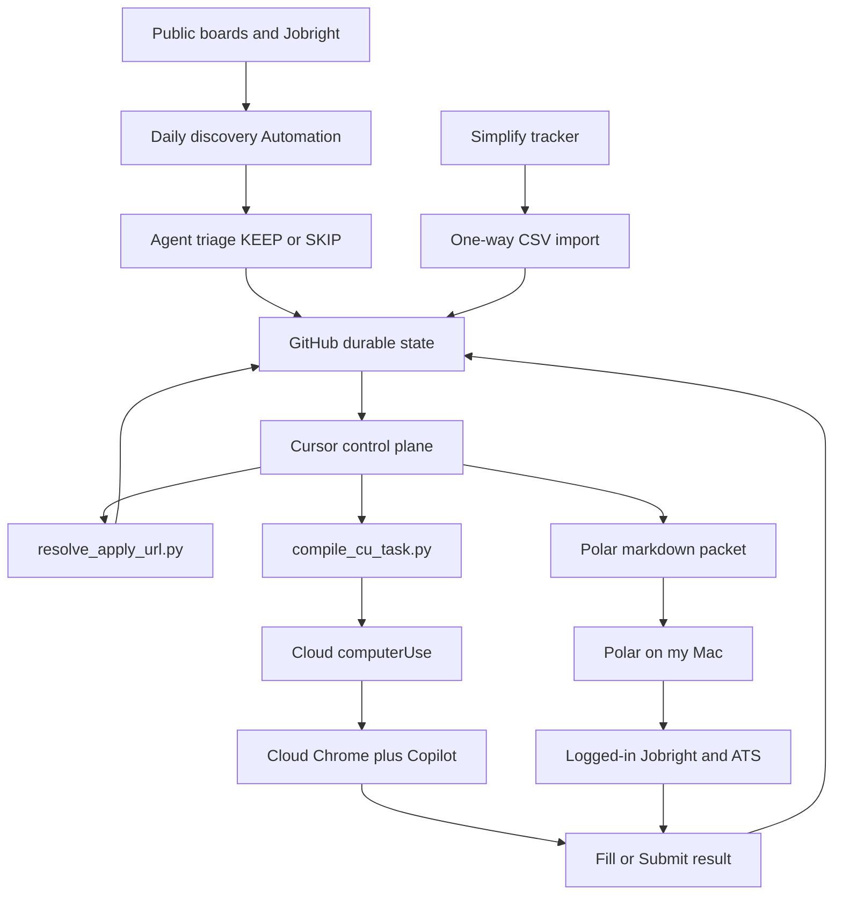

# Architecture that emerged

This is not a target architecture I wrote on day one. It is the split
that survived contact with Jobright, Cloud Agent disks, Computer Use
children, and one local Polar browser.

## Overview

The repository is a strategy and memory layer. Simplify is the public
apply ledger. Cursor is the control plane. Browser execution has two
homes that do not share cookies.

Cloud Computer Use clicks on a snapshotted VM when the apply harness
is present. Polar clicks on my Mac when I paste a packet. Neither side
is allowed to invent a second KEEP list.

## Key concepts

**Durable state.** Git. Profile, evidence bank, form strategy, submit
gates, applications, decisions, activity log.

**Control plane.** Cursor Cloud Agents and the Daily Job Discovery
Automation. They scrape, merge, triage, resolve public ATS URLs, and
compile Computer Use sheets.

**Execution plane, cloud.** `computerUse` on the Cloud Agent VM, plus
Simplify Copilot if the personal environment snapshot has it.

**Execution plane, local.** Polar on my already-logged-in browser.
Jobright Original Job Post. Employer ATS.

**Handoff.** A compiled Task string for Computer Use. A markdown packet
for Polar. The child does not inherit `AGENTS.md`.

**Ledger.** `data/applications.csv` plus Simplify import. Polar must
not own this file. Until a write path exists, a human or a later
Cursor turn copies Polar's result.

## How it works now

Discovery never writes the ledger. [`docs/state/REALITY_MAP.md`](../docs/state/REALITY_MAP.md)
recorded that boundary as holding for a 39-day window ending 2026-09-03
on an older `main`. Treat the count as that snapshot, not a live metric.

Apply URL resolution is a complement, not a replacement, for Original
Job Post. Public board APIs help cloud runs that have no Jobright
session. Polar prefers a trusted `apply_url`, then Original Job Post.
It must not click Jobright APPLY WITH AUTOFILL.

Computer Use is mode-bounded. Execute, verify, repair, or submit. The
parent already knows the answers. The child does not rediscover the
form. Polar does not load `compile_cu_task.py`. Wrapping Polar inside
a `computerUse` Task would put the wrong sandbox around the right
browser.

Submit is a gate, not a default. `docs/policy/SUBMIT_ROLLOUT.md` keeps
G2 closed. Prioritized rows always stop for a review packet.

## Evolution, not a clean-room design

1. **July.** Local Playwright session export and a discovery
   Automation. The apply queue web app is built and then unused.
2. **31 July.** Autofill works on resolved URLs. Discovery URLs do
   not. The resolver is added because the keep list is unactionable.
3. **August.** Cloud disks lose Copilot. The harness checker and a
   personal snapshot become mandatory. Copilot misfills sponsorship
   and U.S. Person widgets. Autofill Again undoes corrections.
4. **24 August.** Nested cloud children cannot click. Isolation
   transcripts show a clean child context. Leftover typing becomes
   one paste. Token sinks are named.
5. **3 September.** Twitch measures the observation loop. The parent
   compiler and lint fixtures land.
6. **4 September.** Polar is named as the local execution plane. The
   same day, a Polar packet fills Quantbot Greenhouse and stops.
   The next Polar packet reaches Workday and dies on Create Account.

The interesting part is the repeated move. When a layer failed, I did
not add a synonym for "try harder." I moved the responsibility.

- URL missing → resolver, later Original Job Post.
- Session missing → snapshot, later Polar on my machine.
- Child missing rules → parent compiler.
- Child missing the clicker tool → dashboard agent, not a nested Task.
- Observation loops → lint, not a longer "please don't scroll" sentence.
- Polar succeeding locally → keep Cursor as the brain anyway.

## Where things live

| Piece | Path |
|---|---|
| Polar essay | `docs/automation/POLAR.md` |
| Computer Use contract | `docs/automation/COMPUTER_USE_PROMPT.md` |
| Compiler | `scripts/compile_cu_task.py` |
| Form rules | `knowledge/form_strategy.yaml` |
| Harness check | `scripts/automation/check_apply_harness.py` |
| URL resolver | `scripts/resolve_apply_url.py` |
| Ledger helpers | `scripts/apply_ledger.py`, `scripts/js_lib.py` |
| Submit gates | `docs/policy/SUBMIT_ROLLOUT.md`, `config/submit_gates.yaml` |
| Platforms | `docs/platforms.md` |

Quantbot and Rakuten packets are copied onto this branch from
`ed40f98` and `b49d073`. See [`EVIDENCE.md`](EVIDENCE.md) C013 and C014.

## Gotchas

- Copilot does not read this repo. A YAML fact can stay unused on the
  form.
- Copilot "Completed" is not proof the widget has a value.
- `computerUse` is not the public Browser builtin.
- Cloud and Polar cookies never sync. A cloud 2FA is a dead end for
  Original Job Post.
- Polar Workflow as a product feature is owner-observed. Unattended
  consumption of this repo's queue is unproven.
- One Polar fill that was not spam-flagged is one fill.
- REALITY_MAP is a 2026-09-03 snapshot. Some counts in it are older
  than Polar and older than later ledger imports.
